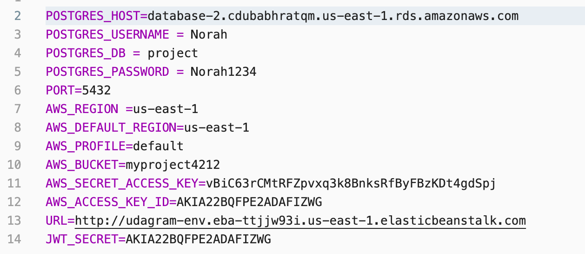
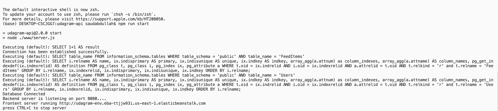
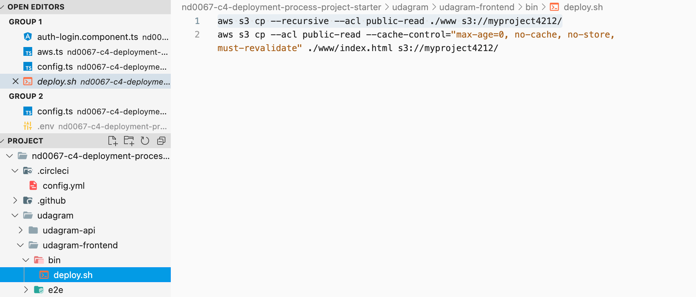
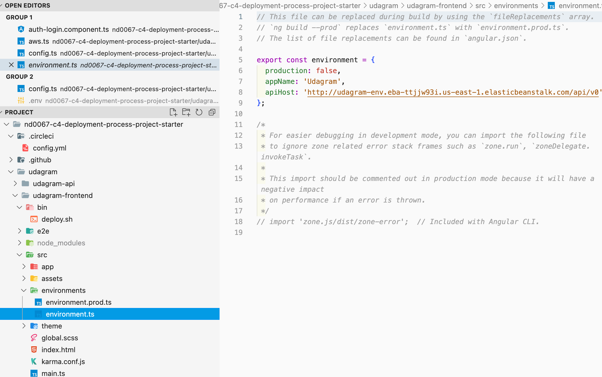
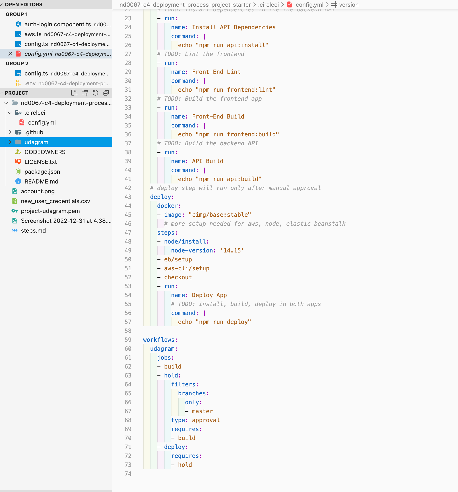
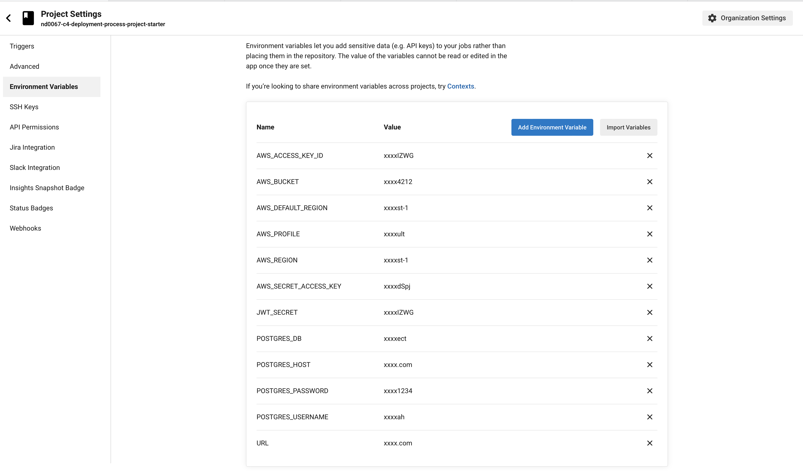

# Deployment Steps:

To deploy the Udagram, We need to generate 4 things (EC2, RDS , EB , S3 Bucket):

## 1st: EC2 Instance:

1. Create EC2 Instance using AWS EC Console (I named my instance `udagram`).
2. Generate pem file to connect ssh.

## 2nd: RDS:

1. Create RDS using AWS (it named `database-2`).
2. Edit the security group's inbound rule to allow incoming connections from anywhere.
3. Check Connection To make sure the RDS is connected using the follwing command:

   ```bash
        psql -h database-2.cdubabhratqm.us-east-1.rds.amazonaws.com -U Norah project
   ```

4. Create .env file and add the required enviroment variables in config > config.ts file & edit the POSTGRES_HOST to store the link of the newly created RDS.

   

5. Build and Run the application to lunch migrations and create tables in RDS, the result of ` npm run start ` would be the follwing image:

   

## 3rd: S3 Bucket:

1. Create empty bucket using CLI or S3 Console (I named it `myproject4212`).
2. Edit the properties of the bucket to:
   - allow static web hosting.
   - add CORS.
   - add ploicy.
3. Add the newly created bucket `AWS_BUCKET=myproject4212` to the .env file in the udagram-api.

   

4. Edit deploy.sh to add the name of the bucket:

   

## 4th: EB:

1. Create eb app and enviroment using the CLI or EB Console (my eb app name is `udagram-api` & eb environment is `udagram-env`).
2. cd to where the pem file is located and then setup ssh file to EC instance that is created in first step.
3. Automate enviroment variables to be pushed from the CircleCi the newly created (eb app), by adding the follwing script to the udagram-api/bin/deploy.sh:

   `eb setenv AWS_ACCESS_KEY_ID=AWS_ACCESS_KEY_ID AWS_BUCKET=AWS_BUCKET AWS_DEFAULT_REGION=AWS_DEFAULT_REGION AWS_PROFILE=AWS_PROFILE AWS_REGION=AWS_REGION AWS_SECRET_ACCESS_KEY=AWS_SECRET_ACCESS_KEY JWT_SECRET=JWT_SECRET POSTGRES_DB=POSTGRES_DB POSTGRES_DB=POSTGRES_HOST POSTGRES_PASSWORD=POSTGRES_PASSWORD POSTGRES_USERNAME=POSTGRES_USERNAME URL=URL`

   then, call this deploy.sh in the udagram-api/package.json

   `npm run build && eb list && eb use udagram-api-dev && chmod +x bin/deploy.sh && eb deploy`

   Note: the environment variables in deploy.sh should match the environment variables in CircleCi pipeline

4. Link the newly created EB with udagram-api > enviroment.ts & enviroment.prod.ts:

   

5. Run `eb deploy` to deploy the backend **udagram-api**.

## Configuring CircleCi:

1. Add the required scripts (TODO) in circleci > config.yml , like the following:

   

2. Initilaize gitgub repository to push the project.
3. Connect CircleCi to the github repo of forked the udagram project.
4. Add enviroment variables to CircleCi like the following:

   

### Result:

1. S3 Bucket should be filled with the udagram-frontend www files, once **CircleCi finish deploying**.
2. Another S3 Bucket (automatically generated and filled) once the deployment of the udagram-api is finished (in my case it named `elasticbeanstalk-us-east-1-743130364212`).
3. Another EC2 Incstance is automatically created once **eb env** is created (in my case it named `udagram-env`).