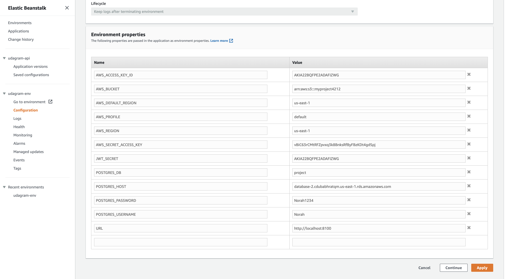

# Deployment Steps:

To deploy the Udagram, We need to generate 4 things (EC2, RDS , EB , S3 Bucket):

## 1st: EC2 Instance:

1. create EC2 Instance using AWS EC Console.
2. generate pem file to connect ssh.

## 2nd: RDS:

1. Create RDS using AWS.
2. Edit the security group's inbound rule to allow incoming connections from anywhere.
3. Check Connection To make sure the RDS is connected using the follwing command:

   ```bash
        psql -h mydbinstance.csxbuclmtj3c.us-east-1.rds.amazonaws.com -U [username] postgres
   ```

4. Create .env file and add the required enviroment variables in config > config.ts file & edit the POSTGRES_HOST to store the link of the newly created RDS.

   .

5. run the build and start the application to lunch migrations and create tables in RDS, the result of ` npm run ` would be the follwing image:

   .

## 3rd: S3 Bucket:

1. create empty bucket using CLI or S3 Console.
2. edit the properties of the bucket to:
   - allow static web hosting.
   - add CORS.
   - add plociy.
3. add the newly created bucket to the .env file in the udagram-api.

   .

4. edit deploy.sh to add the name of the bucket:

   .

## 4th: EB:

1. Create eb app and enviroment using the CLI or EB Console.
2. cd to where the pem file is located and then setup ssh file to EC instance pem file that is created in first step.
3. add enviroment variables to the newly created (eb app), like the following image:
   .
4. link the newly created EB with udagram-api > enviroment.ts & enviroment.prod.ts:
   .
5. run eb deploy.

## Configuring CircleCi:

1. add the required scripts in TODO, like the following:

   .

2. initilaize gitgub repository to push the project.
3. connect CircleCi to the github repo of forked the udagram project.